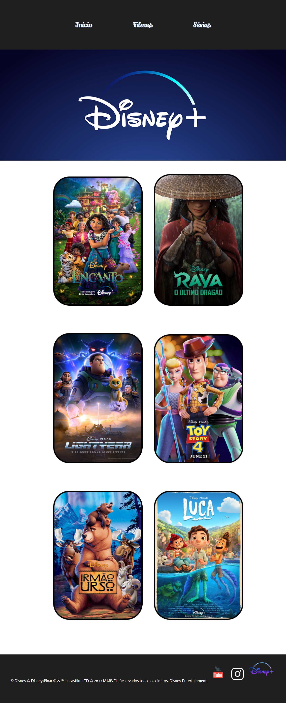

<h1 align="center">
  💻 DESAFIO - Disney
</h1>
Esse é um desafio proposto pelo curso de Front-end oferecido pelo <a href = "https://vainaweb.com.br/">Vai na web.</a>
O desafio tinha como objetivo fazer um clone de um projeto desenvolvido pelos instrutores do Vai na web, o qual foi disponibilizdo no <a href="https://www.figma.com/file/xfz72ArMARKGUGeog126Ki/Desafio-2?type=design&node-id=1-2&t=I5s0edzn0v0aJPFD-0">Figma</a>, foi possível aplicar os conceitos ensinados ao longo das aulas.

## 📚 Seções

O site é composto por três seções:

- **Header:** Nele temos uma breve apresentação de uma barra de navegação
- **Main:** Aborda os banners de alguns filmes da plataforma;
- **Footer:** Apresenta os direitos autorais da plataforma e simulação dos links das redes sociais;
---

## 💼 Tecnologias utilizadas

Para o desenvolvimento deste site utilizei as seguintes tecnologias:

- HTML;
- CSS;
- Figma
- GIT e Github
